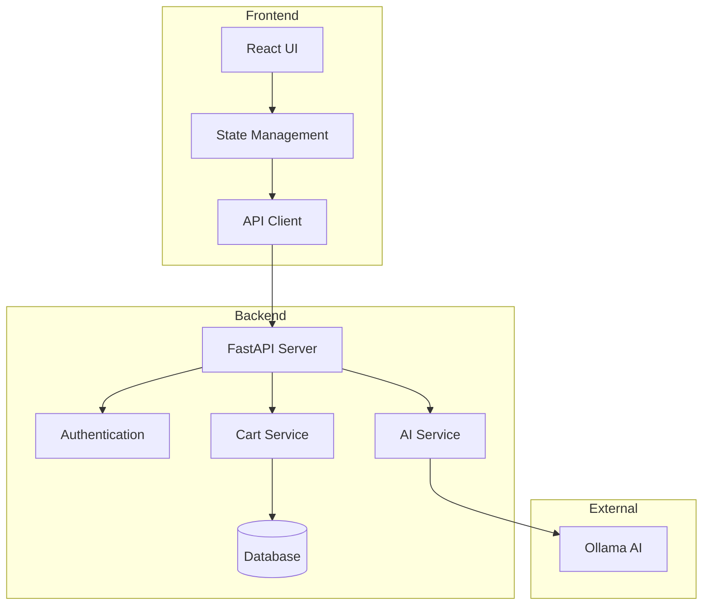
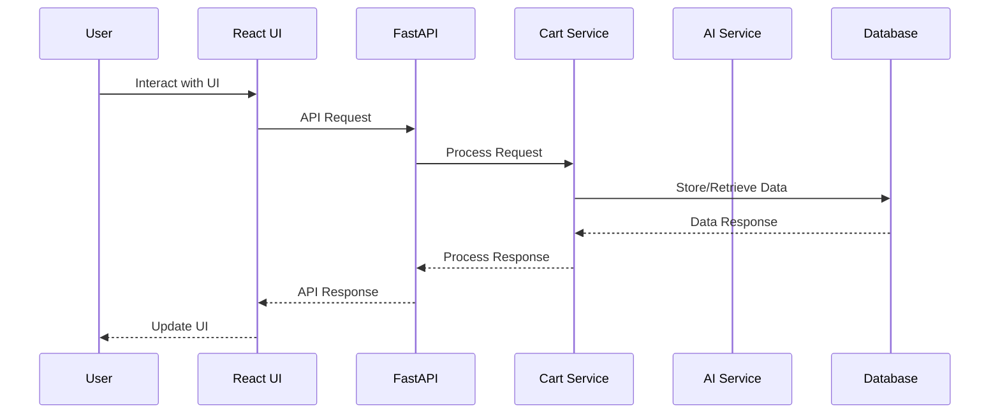
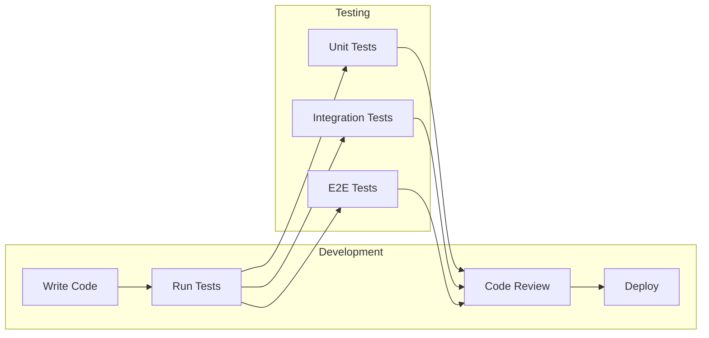

# AI-Powered Restaurant Ordering System

[](https://github.com/yourusername/restaurant-ordering-system/actions/workflows/backend-ci.yml)
[](https://github.com/yourusername/restaurant-ordering-system/actions/workflows/frontend-ci.yml)
[](https://codecov.io/gh/yourusername/restaurant-ordering-system)
[](https://opensource.org/licenses/MIT)
[](https://www.python.org/downloads/)
[](https://nodejs.org/)
[](http://makeapullrequest.com)

A modern restaurant ordering system that uses AI to enhance the ordering experience. The system features a FastAPI backend and a React frontend with a beautiful, responsive UI.

## Architecture



## Request Flow



## Development Workflow



## Features

- 🤖 AI-powered menu recommendations and order assistance
- 🛒 Real-time cart management
- 📱 Responsive design for all devices
- 🔒 Secure authentication and authorization
- 🎨 Modern, intuitive user interface
- 📊 Real-time order tracking
- 🔍 Advanced search and filtering
- 🌐 Multi-language support

## Tech Stack

### Backend
- FastAPI (Python web framework)
- SQLAlchemy (ORM)
- Pydantic (Data validation)
- JWT (Authentication)
- Ollama (AI integration)
- Pytest (Testing)

### Frontend
- React 18
- TypeScript
- Tailwind CSS
- React Query
- React Router
- Jest & React Testing Library

## Prerequisites

- Python 3.8+
- Node.js 18+
- Ollama (for AI features)
- Git

## Installation

1. Clone the repository:
```bash
git clone <repository-url>
cd restaurant-ordering-system
```

2. Set up the backend:
```bash
cd backend
python -m venv venv
source venv/bin/activate  # On Windows: venv\Scripts\activate
pip install -r requirements.txt
```

3. Set up the frontend:
```bash
cd frontend
npm install
```

4. Configure environment variables:
```bash
# Backend (.env)
cp .env.example .env
# Edit .env with your configuration

# Frontend (.env)
cp .env.example .env
# Edit .env with your configuration
```

## Development

### Backend Development

1. Start the backend server:
```bash
cd backend
source venv/bin/activate  # On Windows: venv\Scripts\activate
python run.py
```

The backend will be available at `http://localhost:8000`

### Frontend Development

1. Start the frontend development server:
```bash
cd frontend
npm run dev
```

The frontend will be available at `http://localhost:3000`

## Testing

### Backend Testing

1. Install test dependencies:
```bash
cd backend
pip install -r tests/requirements-test.txt
```

2. Run tests:
```bash
# Run all tests
pytest

# Run with coverage report
pytest --cov=app --cov-report=html

# Run specific test types
pytest -m unit      # Run unit tests
pytest -m integration  # Run integration tests
```

Test coverage reports will be available in the `htmlcov` directory.

### Frontend Testing

1. Run tests:
```bash
cd frontend
npm test
```

2. Run tests with coverage:
```bash
npm test -- --coverage
```

## Project Structure

```
restaurant-ordering-system/
├── backend/
│   ├── app/
│   │   ├── api/
│   │   ├── core/
│   │   ├── models/
│   │   ├── services/
│   │   └── utils/
│   ├── tests/
│   │   ├── unit/
│   │   ├── integration/
│   │   └── conftest.py
│   ├── requirements.txt
│   └── run.py
├── frontend/
│   ├── src/
│   │   ├── components/
│   │   ├── pages/
│   │   ├── services/
│   │   └── utils/
│   ├── public/
│   └── package.json
└── README.md
```

## API Documentation

Once the backend server is running, you can access the API documentation at:
- Swagger UI: `http://localhost:8000/docs`
- ReDoc: `http://localhost:8000/redoc`

## Contributing

1. Fork the repository
2. Create a feature branch
3. Commit your changes
4. Push to the branch
5. Create a Pull Request

## License

This project is licensed under the MIT License - see the LICENSE file for details.

## Support

For support, please open an issue in the GitHub repository or contact the maintainers.

## Acknowledgments

- FastAPI team for the excellent web framework
- React team for the frontend library
- Ollama team for the AI capabilities
- All contributors who have helped shape this project 