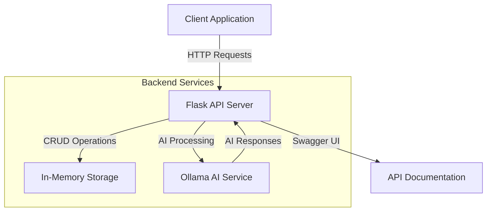
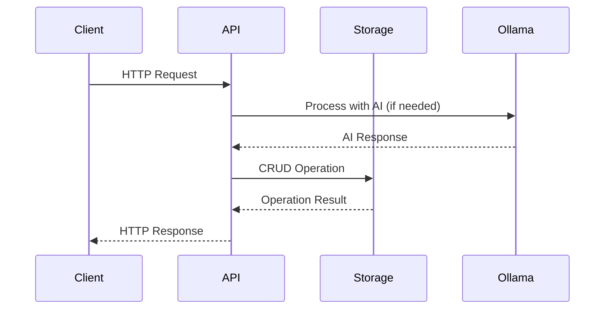

# Food Order Cart API Backend

A Flask-based REST API service for managing food order carts with AI-powered conversation capabilities.

## Architecture



## Request Flow



## Features

- **CRUD Operations**: Create, Read, Update, Delete items in shopping carts
- **Conversation-based Carts**: Each cart is associated with a unique conversation ID
- **AI Integration**: Powered by Ollama for intelligent conversation handling
- **Item Management**: Support for complex item structure with modifiers and instructions
- **In-Memory Storage**: Local static storage for development and testing
- **Swagger Documentation**: Interactive API documentation
- **RESTful Design**: Following REST principles and best practices

## Project Structure

```
backend/
├── app/
│   ├── __init__.py
│   ├── api/
│   │   ├── __init__.py
│   │   ├── routes/
│   │   │   ├── __init__.py
│   │   │   └── cart_routes.py
│   │   └── schemas/
│   │       ├── __init__.py
│   │       └── cart_schemas.py
│   ├── core/
│   │   ├── __init__.py
│   │   ├── config.py
│   │   └── security.py
│   ├── models/
│   │   ├── __init__.py
│   │   └── cart_models.py
│   └── services/
│       ├── __init__.py
│       ├── cart_service.py
│       └── ai_service.py
├── tests/
│   ├── __init__.py
│   ├── conftest.py
│   ├── test_api/
│   │   └── test_cart_routes.py
│   └── test_services/
│       └── test_cart_service.py
├── .env.example
├── config.yaml
├── requirements.txt
└── run.py
```

## Configuration

Create a `config.yaml` file in the root directory:

```yaml
server:
  host: localhost
  port: 5000
  debug: true

ollama:
  base_url: http://localhost:11434
  model: llama2
  temperature: 0.7
  max_tokens: 1000

storage:
  type: memory
  cleanup_interval: 3600  # seconds

api:
  version: v1
  prefix: /api/v1
```

## API Endpoints

### Base URL
```
http://localhost:5000/api/v1
```

### Endpoints Overview

| Method | Endpoint | Description |
|--------|----------|-------------|
| `POST` | `/cart/{conversation_id}/items` | Add item to cart |
| `GET` | `/cart/{conversation_id}/items` | Get all items in cart |
| `GET` | `/cart/{conversation_id}/items/{item_id}` | Get specific item |
| `PUT` | `/cart/{conversation_id}/items/{item_id}` | Update specific item |
| `DELETE` | `/cart/{conversation_id}/items/{item_id}` | Delete specific item |
| `POST` | `/cart/{conversation_id}/order` | Place order from cart |

## Installation

1. **Create virtual environment**
   ```bash
   python -m venv venv
   source venv/bin/activate  # On Windows: venv\Scripts\activate
   ```

2. **Install dependencies**
   ```bash
   pip install -r requirements.txt
   ```

3. **Configure environment**
   ```bash
   cp .env.example .env
   # Edit .env with your configuration
   ```

4. **Run the application**
   ```bash
   python run.py
   ```

## Dependencies

```txt
Flask==2.3.3
flask-restx==1.1.0
Werkzeug==2.3.7
PyYAML==6.0.1
requests==2.31.0
python-dotenv==1.0.0
pytest==7.4.0
pytest-cov==4.1.0
black==23.7.0
flake8==6.1.0
```

## Testing

Run tests with coverage:
```bash
pytest --cov=app tests/
```

## API Documentation

Access the Swagger UI at: `http://localhost:5000/swagger-ui`

## Error Handling

The API returns appropriate HTTP status codes and error messages:

- `200 OK`: Successful operation
- `201 Created`: Item successfully added
- `400 Bad Request`: Invalid input data
- `404 Not Found`: Cart or item not found
- `422 Unprocessable Entity`: Validation errors
- `500 Internal Server Error`: Server errors

### Error Response Format

```json
{
  "success": false,
  "error": "Item not found in cart",
  "code": "ITEM_NOT_FOUND"
}
```

## Development Guidelines

Please refer to the [Project Guidelines](../.cursor/guidelines.md) for detailed information about:
- Code organization
- Git workflow
- Testing standards
- Documentation requirements
- Security guidelines
- Performance optimization 