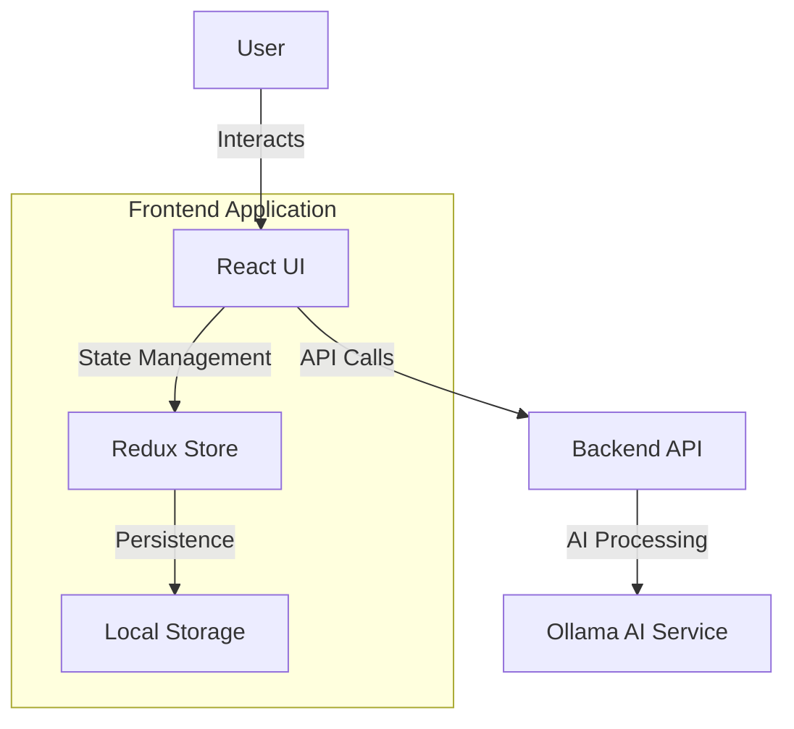
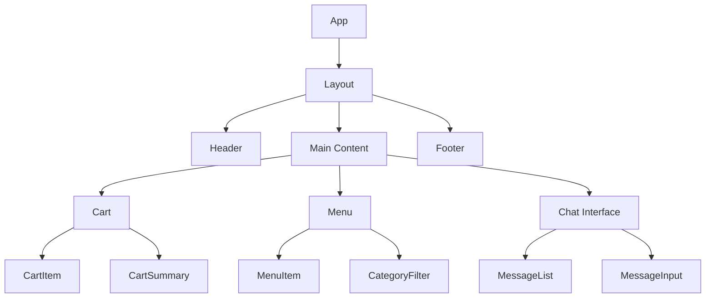

# Food Order Cart Frontend

A modern React application for managing food order carts with AI-powered conversation capabilities.

## Architecture



## Component Structure



## Features

- **Modern UI/UX**: Built with React and Material-UI
- **Real-time Updates**: Live cart synchronization
- **AI Integration**: Chat interface with Ollama
- **Responsive Design**: Mobile-first approach
- **State Management**: Redux for global state
- **Type Safety**: TypeScript implementation
- **Accessibility**: WCAG 2.1 compliant

## Project Structure

```
frontend/
├── public/
│   ├── index.html
│   ├── favicon.ico
│   └── assets/
├── src/
│   ├── components/
│   │   ├── common/
│   │   │   ├── Button/
│   │   │   ├── Input/
│   │   │   └── Modal/
│   │   ├── cart/
│   │   │   ├── Cart.tsx
│   │   │   ├── CartItem.tsx
│   │   │   └── CartSummary.tsx
│   │   ├── menu/
│   │   │   ├── Menu.tsx
│   │   │   ├── MenuItem.tsx
│   │   │   └── CategoryFilter.tsx
│   │   └── chat/
│   │       ├── Chat.tsx
│   │       ├── MessageList.tsx
│   │       └── MessageInput.tsx
│   ├── hooks/
│   │   ├── useCart.ts
│   │   ├── useChat.ts
│   │   └── useMenu.ts
│   ├── store/
│   │   ├── index.ts
│   │   ├── cart/
│   │   ├── menu/
│   │   └── chat/
│   ├── services/
│   │   ├── api.ts
│   │   ├── cartService.ts
│   │   └── chatService.ts
│   ├── utils/
│   │   ├── formatters.ts
│   │   └── validators.ts
│   ├── types/
│   │   └── index.ts
│   ├── styles/
│   │   └── theme.ts
│   ├── App.tsx
│   └── index.tsx
├── .env.example
├── package.json
├── tsconfig.json
└── README.md
```

## Installation

1. **Install dependencies**
   ```bash
   npm install
   ```

2. **Configure environment**
   ```bash
   cp .env.example .env
   # Edit .env with your configuration
   ```

3. **Start development server**
   ```bash
   npm start
   ```

## Dependencies

```json
{
  "dependencies": {
    "@emotion/react": "^11.11.0",
    "@emotion/styled": "^11.11.0",
    "@mui/material": "^5.13.0",
    "@reduxjs/toolkit": "^1.9.5",
    "axios": "^1.4.0",
    "react": "^18.2.0",
    "react-dom": "^18.2.0",
    "react-redux": "^8.0.5",
    "react-router-dom": "^6.11.1",
    "typescript": "^5.0.4"
  },
  "devDependencies": {
    "@testing-library/jest-dom": "^5.16.5",
    "@testing-library/react": "^14.0.0",
    "@types/jest": "^29.5.1",
    "@types/node": "^20.1.4",
    "@types/react": "^18.2.6",
    "@types/react-dom": "^18.2.4",
    "eslint": "^8.40.0",
    "prettier": "^2.8.8",
    "jest": "^29.5.0"
  }
}
```

## Available Scripts

- `npm start`: Start development server
- `npm test`: Run tests
- `npm run build`: Build for production
- `npm run lint`: Run ESLint
- `npm run format`: Format code with Prettier

## Component Documentation

### Cart Component
The main cart component that displays all items in the cart and handles cart operations.

```typescript
interface CartProps {
  conversationId: string;
  onUpdate?: (items: CartItem[]) => void;
}
```

### Menu Component
Displays the menu items and handles item selection.

```typescript
interface MenuProps {
  onItemSelect: (item: MenuItem) => void;
  category?: string;
}
```

### Chat Component
Handles AI-powered conversation interface.

```typescript
interface ChatProps {
  conversationId: string;
  onMessage?: (message: Message) => void;
}
```

## State Management

The application uses Redux Toolkit for state management with the following slices:

- **cart**: Manages cart state and operations
- **menu**: Handles menu items and categories
- **chat**: Manages conversation state

## API Integration

The frontend communicates with the backend API using Axios. All API calls are centralized in the `services` directory.

## Styling

The application uses Material-UI with a custom theme. The theme configuration can be found in `src/styles/theme.ts`.

## Testing

Run tests with:
```bash
npm test
```

The application uses Jest and React Testing Library for testing.

## Development Guidelines

Please refer to the [Project Guidelines](../.cursor/guidelines.md) for detailed information about:
- Code organization
- Git workflow
- Testing standards
- Documentation requirements
- Security guidelines
- Performance optimization

## Accessibility

The application follows WCAG 2.1 guidelines:
- Semantic HTML
- ARIA labels
- Keyboard navigation
- Color contrast
- Screen reader support

## Performance Optimization

- Code splitting
- Lazy loading
- Memoization
- Image optimization
- Bundle size optimization 